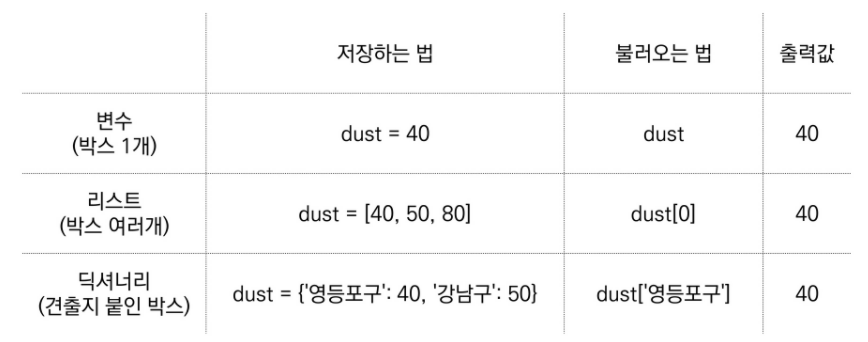

# day1

## python

list   []

dictionary   {}

---

if  조건 :

if else

elif ( 다른언어에서는 else if 지만 파이썬에서는 elif)

---

반복문  for 

for i in number:

 print(i)

---

반복문 while

n = 0

while n < 3:

  print(n) 

  n += 1

---

파이썬 내장 함수 

len() 글자의 길이

abs() 절대값 

등등 많이 있음

---

random 모듈 사용하기

