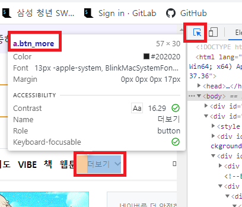
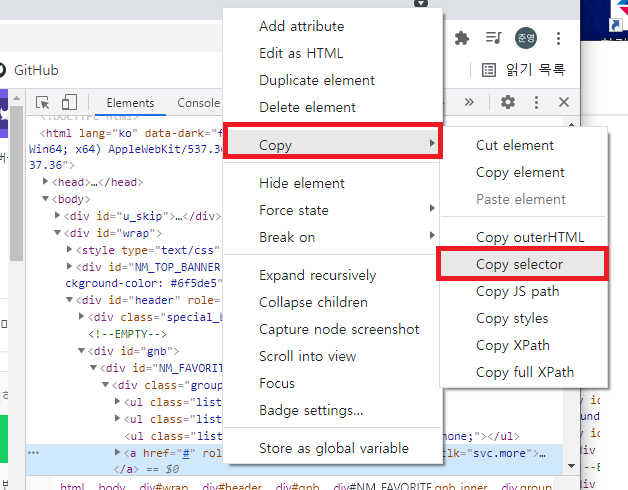

# day2

## python

git 과 연결하기

처음 연결할때 user 이름 과 이메일을 지정해줘야한다.

```
git config --global user.name 이름
git config --global user.email 이메일주소
git config --global -l   #설정 확인
```

---

현재폴더에 git master 지정

```
git init
git remote add origin 깃주소
git remote -v    # 목록확인
```

---

git 에 파일 올리기

staging area에 올리기

```
git add .       #해당폴더의 모든 파일
git add [파일명] #해당 파일만
```

commit 하기

```
git commit -m '  파일을 커밋할때 표시할 내용 (수정사항)  '
```

git 에 넣기

```
git push origin master
```

---

data type.py

숫자

문자열

참/거짓

---

웹 페이지 크롤링

```
$ pip install requests
```

​	requests 를 이용한다.

```
import requests
#시작부분에 넣어줘야 한다.

request.get(주소)
request.get(주소).text                #글만 뽑기
request.get(주소).status_code         #상태만 뽑기
```

---

그페이지에서 가져오고 싶은 data를 선택하기

```
$ pip install beautifulsoup4
```

파이썬이 그 응답결과를 예쁘게 관리

```
from bs4 import BeautifulSoup
#시작부분에 넣어줘야 한다.

BeautifulSoup(문서)    		 #ex) data = BeautifulSoup(response)
BeautifulSoup.select(경로)     #ex) data.select(response)     특정 내용만 뽑기
BeautifulSoup.select_one(경로) #ex) data.select_one('정보경로') 특정 내용 하나만 뽑기
```

파이썬이 주소에 대한 요청을 보내고(resquests), 그 응답 결과를 예쁘게 관리한다.(bs4)

---

1.원하는 위치에서 오른쪽 마우스 클릭 후 검사

2.원하는 정보 가져오기  F12 클릭

copy  > selector






---

json 데이터만을 주고 받기 위한 표기법

크롬에서 json viewer 을 설치해야 깔끔하게 볼 수 있다.

---

국가 알아보기

https://api.nationalize.io/?name=jun  이름을 변수 지정

 python으로 값 불러오기 실습 (national.py)


여기서 API 란?

응용 프로그램에서 사용할 수 있도록, 운영 체제나 프로그래밍 언어가 제공하는 기능을 제어할 수 있게 만든 인터페이스


내일할 미세먼지에서 다시다룰 예정

